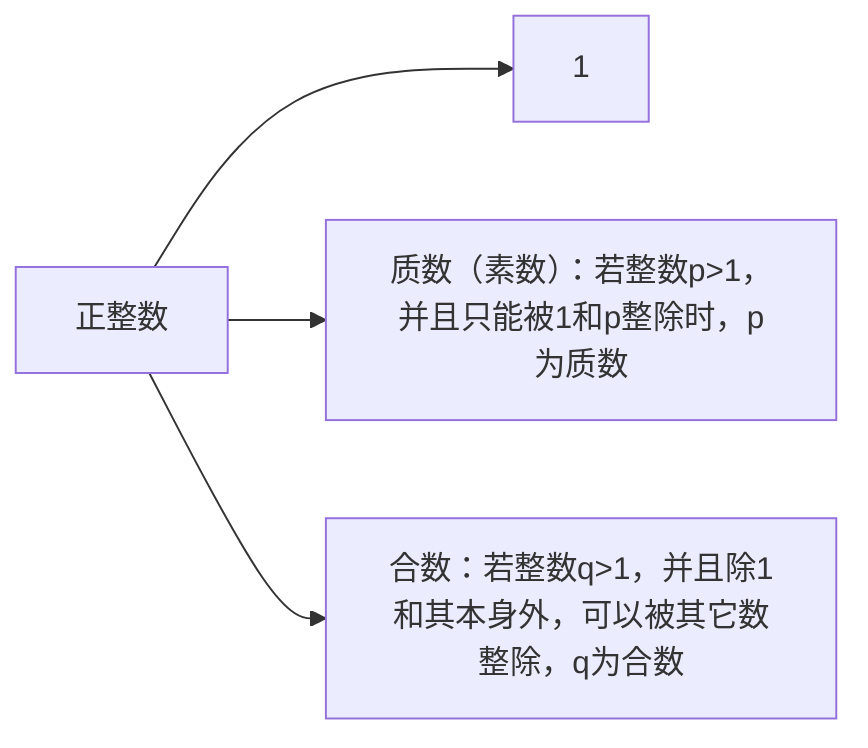

## 约数求和

题目：给定任意正整数n，求n的所有约数的和
#### 前提引入

正整数1024的所有约数的和为多少？
$$
\begin{align*}
1024 &= 2^{10}\\
	 &= 2 \cdot2 \cdot2 \cdot2 \cdot2 \cdot2 \cdot2 \cdot2 \cdot2 \cdot2 
\end{align*}
$$
1024的约数和为：
$$
2^0 + 2^1 + 2^2 +2^3+ 2^4+2^5+2^6+2^7+2^8+2^9+2^{10}
$$
那么我们可以使用等比数列求和公式进行求解：
$$
\frac{1 - x^{n + 1}}{1-x}=\frac{1 - 2^{11}}{1-2}
$$
因此，1024的所有约数和为：2047

但是，若给定任意正整数n，求n的所有约数和，如我们所知并不是所有的n都可以写出形如1024的形式，那么如何处理呢？

<p>
    <center style="background-color:yellow">质因数分解定理</center>
 </p>

在了解质因数分解定理前，我们先了解一下质数和合数：

##### 质数与合数



==Q==：为什么**1**不是素数？
A：因为质因数分解有唯一分解定理——将某个正整数**n**分解质因数时，其形式是唯一的
比如：
$$
24 = 2 \cdot 2 \cdot 2 \cdot 3
$$
将上式2和3调换位置时，只是质因数的顺序不同，但仍是同一种形式
$$
2\cdot2\cdot2\cdot3 = 3\cdot2\cdot2\cdot2
$$
但是，若1是素数的话，唯一分解定理就不成立了
$$
&\begin{aligned}
2 \cdot 2 \cdot 2 \cdot 3 \\
1 \cdot 2 \cdot 2 \cdot 2 \cdot 3 \\
1 \cdot 1 \cdot 2 \cdot 2 \cdot 2 \cdot 3 \\
·\\
·\\
·
\end{aligned}
$$
因为会产生两个及以上的形式，形式不唯一，不满足唯一分解定理

因此，1不是素数

#### 质因数分解定理

​	若n是一个合数，那么对n进行质因数分解时，一定会分解为质数相乘；因为，若n分解后仍是合数，那么再进行分解，直到所有约数为质数时终止
$$
\begin{align*}
24 &= 2 \cdot 12 \\
   &= 2 \cdot 2 \cdot 6\\
   &= 2 \cdot 2 \cdot 2 \cdot 3 \\
   &= 2^3 \cdot 3^1
\end{align*}
$$
因此，质因数分解定理可以将合数分解为，质数的幂次方的乘积形式：
$$
n = p_0^{a_0} \cdot p_1^{a_1}\cdotp_2^{a_2}\cdot\cdot\cdot p_m^{a_m}
$$
其中，
$$
p_0, p_1,p_2···p_m为质数\\
a^0,a^1,a^2···a^m为正整数
$$
那么，**n**的约数有哪些呢？

#### 约数

对于任意整数n，其约数有哪些呢？
我们不妨先考虑1024的约数：
$$
1024=2^{10}
$$
1024的所有约数：
$$
2^0 ,2^1 ,2^2 ,2^3, 2^4,2^5,2^6,2^7,2^8,2^9,2^{10}
$$
而
$$
n = p_0^{a_0} \cdot p_1^{a_1}\cdotp_2^{a_2}\cdot\cdot\cdot p_m^{a_m}
$$
因此，n的所有约数和为
$$
\begin{align*}
(p_{0}^{0} + p_{0}^{1} + \cdots + p_{0}^{a_0}  )\\
+\\
(p_{1}^{0} + p_{1}^{1} + \cdots + p_{1}^{a_1}  )\\
+ \\
\dots\\
+\\
(p_{n}^{0} + p_{n}^{1} + \cdots + p_{n}^{a_m} )
\end{align*}
$$
上式是n的所有约数吗？

不妨看看，24
$$
24=2^3\cdot3^1
$$
24的所有约数
$$
\begin{align*}
(2^0 + 2^1 + 2^2 +  2^3)\\
+(3^0 + 3^1)
\end{align*}
$$
即
$$
\begin{align*}
(1 + 2 + 4 + 8)\\
+(1 + 3)
\end{align*}
$$
但很明显是错误的，这只是在约数中，以质因数的乘方形式所组成的约数和，且有重复——1；约数和的形式应该是，所有质因数的乘方的排列组合
$$
(1 + 2^1 + 2^2+2^3)*(1+3^1)
$$
即
$$
1+2+4+8+3+6+12+24
$$
因为
$$
n = p_0^{a_0} \cdot p_1^{a_1}\cdotp_2^{a_2}\cdot\cdot\cdot p_m^{a_m}
$$
所以，n的所有约数和为
$$
(1+p_0^1+p_0^2+\dots+p_0^{a_0})\\
*(1+p_1^1+p_1^2+\dots+p_1^{a_1})\\
*(1+p_2^1+p_2^2+\dots+p_2^{a_2})\\
\vdots\\
*(1+p_m^1+p_m^2+\dots+p_m^{a_m})\\
$$
而，在每个括号内可以使用等比数列的求和公式
$$
sum =
\frac{1-p_0^{a_0+1}}{1-p_0} \cdot \frac{1-p_1^{a_1+1}}{1-p_1} \dots \frac{1-p_m^{a_m+1}}{1-p_m}
$$
当我们表示连乘时，可以使用希腊字母：大写的π来表示
$$
sum = \mathop{\Pi}\limits_{k=o}^{m}{\frac{1-p_k^{a_k+1}}{1-p_k} }
$$
其中

- sum为n的所有约数的和

- <p>p<sub>k</sub>为互不相同的质数</p>

- <p>a<sub>k</sub>为指数</p>

#### 代码实现——python


```python
import math

def judge(n): # 判断n是否是素数
    if n < 2:
        return False
    for i in range(2, int(math.sqrt(n)) + 1):
        if not(n % i):
            return False
    return True

def main():
    n = int(input("请输入一个整数： "))
    m = n # 用来记录n，后续n的大小会发生改变
    d = {}
    while(not(judge(n))):
        for i in range(2, int(math.sqrt(n)) + 1):
            if not(n % i):
                d[i] = d.get(i, 0) + 1
                break
        n /= i
    d[int(n)] = d.get(n, 0) + 1
    s = 1 # 约数求和
    for i in d.keys():
        s *= (1 - math.pow(i, d[i] + 1)) / (1 - i)
    print(f"{m}的所有约数和为：{int(s)}")

if __name__ == '__main__':
    main()
```

效果展示：


#### 时间复杂度分析

思路一：求出 n 的所有约数，在依次求和
分析：

```markdown
时间复杂度：
1. 求出n的所有约数：需遍历1~n
2. 在依次将每个约数求和
```

